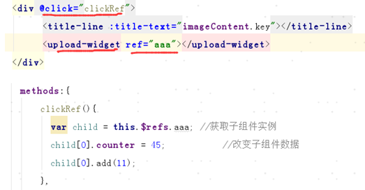
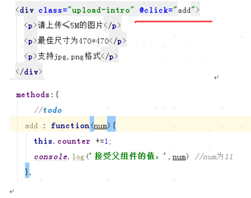

## vue的一些问题收集

### 1.什么时候适合用methods，什么时候适合用compute，d什么时候适合用watch

### 2.各组件如何通信（父传子，子传父，同级组件）
vuex

$emit $on

#### 2.1子调用父例子：

//父组件


//子组件


#### 2.2 父组件调用子组件
//父组件



//子组件



#### 2.3.子组件与子组件通信


### 3.公用方法mixin处理，全局状态该如何存储，如何自定义组件的指令

### 4.vue-cli脚手架了，vue是如何通过使用webpack进行测试和生产环境进行一个构建处理的


### 5 数据筛选 computed（）
```js
1.<li v-for="n in evenNumbers">{{ n }}</li>

data: {
  numbers: [ 1, 2, 3, 4, 5 ]
},
computed: {
  evenNumbers: function () {
    return this.numbers.filter(function (number) {
      return number % 2 === 0
    })
  }
}
```
```js
2.
<li v-for="n in even(numbers)">{{ n }}</li>
data: {
  numbers: [ 1, 2, 3, 4, 5 ]
},
methods: {
  even: function (numbers) {
    return numbers.filter(function (number) {
      return number % 2 === 0
    })
  }
}
```

## 6 vuex

```js
Vuex 是一个专为 Vue.js 应用程序开发的状态管理模式
mapState 辅助函数

import {mapState, mapActions} from 'vuex'
当一个组件需要获取多个状态时候，将这些状态都声明为计算属性会有些重复和冗余。
为了解决这个问题，我们可以使用 mapState 辅助函数帮助我们生成计算属性

Getters
mapGetters辅助函数仅仅是将store中的getters映射到局部计算属性中，用法和mapState类似Getters

更改 Vuex 的 store 中的状态的唯一方法是提交 mutation：
这个mutation都有一个字符串的 事件类型 (type)和一个 回调函数 (handler)。这个回调函数就是我们实际进行状态更改的地方，并且它会接受 state 作为第一个参数：

Action 类似于 mutation，不同在于：
1.Action 提交的是 mutation，而不是直接变更状态。
2.Action 可以包含任意异步操作。

```


### 7
```
1.var data = {
	a:1
}
//共享了同一个 data ， 因此增加一个 counter 会影响所有组件！
data:function(){
	return data
}

//返回全新的 data 对象来解决这个问题
2.data:function(){
	return {
		a:1
	}
}
//vue中data 是一个例外，它必须是函数
```

### 8
```
Vue webpack项目无法在控制台 devTool下断点调试
查找webpack配置,找到devtool
devtool: options.dev ? '#eval-source-map' : '#source-map'
把 #eval-source-map 改成 #source-map 就好了
```

### 9. vue文件中style的scoped属性

scoped可以实现style只作用于当前的.vue文件

```
<div data-v-53795c54 class="user"></div>
css样式是这样的

.user[data-v-53795c54] {
    color:#333;
}
```

